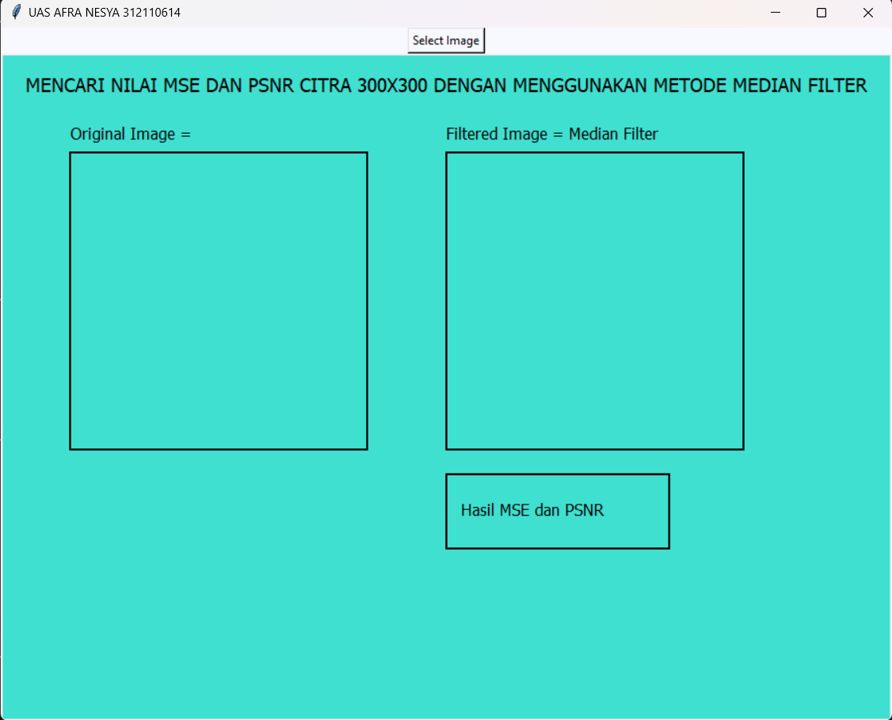
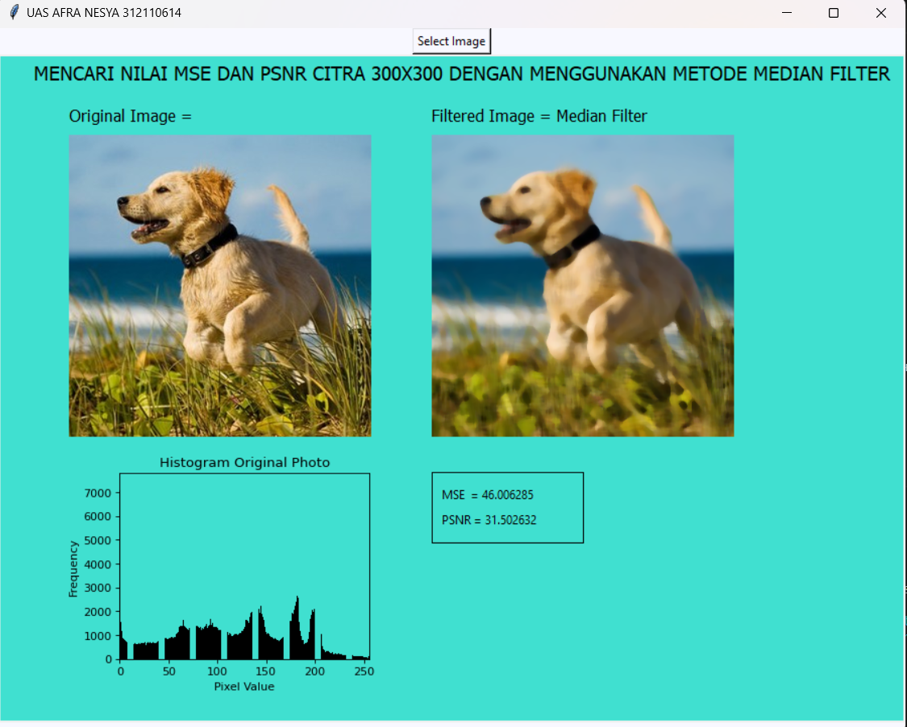

# Tugas_UAS_PengolahanCitraDigital
<br>
Nama             : Afra Nesya Apriyanthi<br>
Nim              : 312110614<br>
Kelas            : TI.21.C1<br>
Mata Kuliah      : Pengolahan Citra<br>
Dosen Pengampu   : Muhammad Najamuddin Dwi Miharja, S.Kom, M.Kom<br>

## Penjelasan Program
1. Impor pustaka dan modul yang diperlukan:
    - cv2: Pustaka OpenCV untuk memanipulasi gambar.
    - numpy: Pustaka untuk operasi numerik dan pemrosesan array.
    - math: Modul untuk fungsi matematika dasar.
    - matplotlib.pyplot: Pustaka untuk membuat plot dan visualisasi data.
    - tkinter.Tk: Modul Tkinter untuk membuat GUI.
    - tkinter.Button: Kelas Button dari modul Tkinter untuk membuat tombol di GUI.
    - tkinter.filedialog.askopenfilename: Fungsi untuk memunculkan dialog pemilihan file.
2. Mendefinisikan fungsi median_filter(image, kernel_size): Fungsi ini menggunakan cv2.medianBlur untuk menerapkan filter median pada gambar dengan ukuran kernel yang ditentukan. Filter median digunakan untuk mengurangi noise pada gambar.
   ```py
    def median_filter(image, kernel_size):
    image_array = np.array(image)
    filtered_image = image_array.copy()

    for i in range(image.height):
        for j in range(image.width):
            r_vals = []
            g_vals = []
            b_vals = []

            for x in range(max(0, i - kernel_size), min(i + kernel_size + 1, image.height)):
                for y in range(max(0, j - kernel_size), min(j + kernel_size + 1, image.width)):
                    r, g, b = image_array[x, y]
                    r_vals.append(r)
                    g_vals.append(g)
                    b_vals.append(b)

            r_median = int(np.median(r_vals))
            g_median = int(np.median(g_vals))
            b_median = int(np.median(b_vals))

            filtered_image[i, j] = [r_median, g_median, b_median]

    return Image.fromarray(filtered_image.astype('uint8'))
   ```
3. Mendefinisikan fungsi mse(original_image, processed_image): Fungsi ini menghitung Mean Squared Error (MSE) antara gambar asli dan gambar yang telah diproses. MSE mengukur perbedaan antara dua gambar dengan menghitung rata-rata perbedaan kuadrat piksel-pikselnya.
   ```py
    def mse(original_image, filtered_image):
    original_pixels = np.array(original_image)
    filtered_pixels = np.array(filtered_image)
    error = np.mean((original_pixels - filtered_pixels) ** 2)
    return error
   ```
4. Mendefinisikan fungsi psnr(original_image, processed_image): Fungsi ini menghitung Peak Signal-to-Noise Ratio (PSNR) antara gambar asli dan gambar yang telah diproses. PSNR mengukur kualitas rekonstruksi gambar dengan membandingkan sinyal gambar dengan derau yang dihasilkan oleh proses pemrosesan.
    ```py
    def psnr(original_image, filtered_image):
    max_intensity = 255
    mse_val = mse(original_image, filtered_image)
    psnr_val = 10 * np.log10((max_intensity ** 2) / mse_val)
    return psnr_val
   ```
5. Mendefinisikan fungsi select_and_process_image(): Fungsi ini digunakan sebagai callback untuk tombol "Pilih Gambar" di GUI. Fungsi ini melakukan langkah-langkah berikut:
    ```py
    def select_image():
    file_path = filedialog.askopenfilename(filetypes=[("Image files", "*.jpg;*.jpeg;*.png")])
    if file_path:
        load_image(file_path)

    def load_image(file_path):
    original_image = Image.open(file_path)
    filtered_image = median_filter(original_image, 3)
    mse_val = mse(original_image, filtered_image)
    psnr_val = psnr(original_image, filtered_image)

    # Clear previous images, texts, and histograms
    canvas.delete("all")

    # Get image sizes
    original_width, original_height = original_image.size

    # Set canvas size to accommodate elements
    canvas.config(width=original_width * 3 + 30, height=original_height * 2 + 60, bg="turquoise")

    # Display original image
    original_photo = ImageTk.PhotoImage(original_image)
    canvas.create_image(70, 80, anchor="nw", image=original_photo)
    canvas.image = original_photo  # Store reference

    # Display filtered image
    filtered_photo = ImageTk.PhotoImage(filtered_image)
    canvas.create_image(original_width + 130, 80, anchor="nw", image=filtered_photo)
    canvas.image2 = filtered_photo  # Store reference
    
     # Display Text
    canvas.create_text(35, 30, anchor="sw", text="MENCARI NILAI MSE DAN PSNR CITRA 300X300 DENGAN MENGGUNAKAN METODE MEDIAN FILTER", fill="black", font=("tahoma", 14))
    canvas.create_text(70, 70, anchor="sw", text="Original Image =", fill="black", font=("tahoma", 12))
    canvas.create_text(original_width + 130, 70, anchor="sw", text="Filtered Image = Median Filter", fill="black", font=("tahoma", 12))
    
    # Making Box
    box_width = 150
    box_height = 70
    box_x = original_width + 130
    box_y = original_height + 115
    canvas.create_rectangle(box_x, box_y, box_x + box_width, box_y + box_height, fill="turquoise")

    #  Display text in the box
    mse_text = f"MSE  = {mse_val:.6f}"
    psnr_text = f"PSNR = {psnr_val:.6f}"
    canvas.create_text(box_x + 10, box_y + 15, anchor="nw", text=mse_text, fill="black")
    canvas.create_text(box_x + 10, box_y + 40, anchor="nw", text=psnr_text, fill="black")

    # Display histogram for original image
    original_hist = get_histogram(original_image)
    plot_histogram(original_hist, 2, 70, original_height + 100)
    
    # Update the canvas view
    canvas.update()
     ```
6. Membuat jendela Tkinter menggunakan tkinter.Tk().
    ```py
      root = tk.Tk()
    ```
7. Mengatur judul jendela menggunakan window.title.
    ```py
      root.title("UAS AFRA NESYA 312110614")
    ```
8. Mengatur ukuran jendela menggunakan window.geometry.
    ```py
      root.geometry("900x700")
    ```
9. Membuat tombol "Pilih Gambar" menggunakan tkinter.Button dengan callback ke fungsi select_and_process_image.
    ```py
      select_button = tk.Button(root, text="Select Image", command=select_image, bg="ghost white")
      select_button.pack()
    ```
10. Menjalankan event loop Tkinter menggunakan window.mainloop(). Event loop ini akan menjaga jendela GUI tetap aktif dan menangani interaksi pengguna seperti menekan tombol.
    ```py
      root.mainloop()
    ```

### Berikut adalah hasil dari program diatas
1. Pertama kita akan disuguhi GUI untuk pilih Gambar
   
2. Kemudian Setelah Memilih Gambar, kita akan melihat GUI tentang Perbandingan Original Image dan Median filter serta mse dan psnr nya, seperti berikut
   
